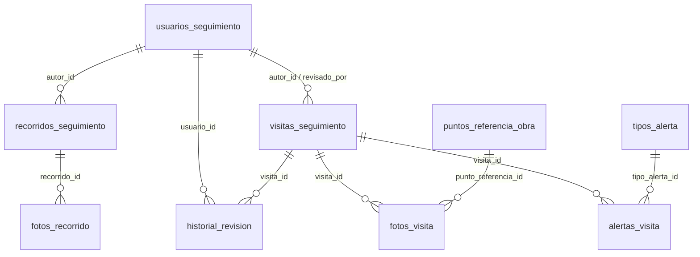

# Base de datos

Postgres en Supabase. **Todo el esquema vive en `supabase/migrations/`**, nunca en el SQL Editor del dashboard: si un cambio no está en un archivo de ahí, no existe para el próximo dev.

> Todas las tablas son **temporales**: se reemplazan cuando exista el backend definitivo del Visor Estratégico.

## Modelo



**`obra_id` no tiene FK.** Las obras viven en la API real del Visor (se leen por la Edge Function `obras-proxy`), no en Supabase. `visitas_seguimiento.obra_id` y `puntos_referencia_obra.obra_id` guardan ese id externo tal cual. Consecuencia: la BD no impide guardar una visita de una obra que no existe; esa validación es de la app.

## Tabla ↔ código

| Tabla | Tipo TS (`src/types/seguimiento.types.ts`) | Quién la lee/escribe |
| --- | --- | --- |
| `usuarios_seguimiento` | `UsuarioSeguimiento` | `features/auth/useUsuarioActual.ts`, `seguimientoApi.ts` |
| `visitas_seguimiento` | `VisitaSeguimiento` | `seguimientoApi.ts` |
| `alertas_visita` | `AlertaVisita` | `seguimientoApi.ts` |
| `fotos_visita` | `FotoVisita` | `seguimientoApi.ts` |
| `historial_revision` | — | `seguimientoApi.ts` (solo escritura) |
| `tipos_alerta` | `TipoAlerta` | `seguimientoApi.ts` (catálogo, con caché) |
| `puntos_referencia_obra` | `PuntoReferenciaObra` | `seguimientoApi.ts` |
| `recorridos_seguimiento` | `RecorridoSeguimiento` | `recorridosApi.ts` |
| `fotos_recorrido` | `FotoRecorrido` | `recorridosApi.ts` |
| Storage `fotos-seguimiento` (privado) | — | ambos `*Api.ts`; visitas en `<visita_id>/…`, recorridos en `recorridos/<id>/…` |

Convención: **la BD es `snake_case`, el código es `camelCase`.** La traducción ocurre en un solo lugar por archivo (`mapVisitaRow`, `mapFotoRow`, `mapRecorridoRow`…). Nada fuera de `features/*Api.ts` debe conocer nombres de columnas.

## Reglas de negocio que viven en la BD

- **RLS activo en todas las tablas**, solo rol `authenticated`. No hay acceso anónimo.
- `rol_actual()` (SECURITY DEFINER) devuelve el rol del usuario; las policies la usan.
- Editar visitas: **sin restricción** (decisión 2026-07-14). Borrar: el autor o cualquier `ingeniero`.
- Un `DELETE` sin policy que lo autorice **no da error**: devuelve 0 filas. Por eso `eliminarVisita` verifica que haya salido algo.
- El estado inicial de una visita lo decide la app (`estadoInicial` en `seguimientoApi.ts`): ingeniero → `revisada`, visitador → `pendiente_revisar`.

## Cómo crear una tabla nueva (checklist)

Lo que sigue evita que la tabla exista en la BD pero no "conecte" con el resto.

1. **Migración.** `npm run db:migracion -- nombre_descriptivo` crea `supabase/migrations/<timestamp>_nombre_descriptivo.sql`. Escribí ahí el `create table`, los índices y:
   - `enable row level security` **siempre** + al menos una policy. Sin policy, RLS deniega todo en silencio.
   - **`GRANT` explícito** a `authenticated` (solo las operaciones que las policies permitan). RLS y GRANT son dos cosas distintas: sin GRANT, PostgREST responde `permission denied for table X` aunque la policy exista. Supabase ya no concede privilegios por defecto a tablas nuevas de `public`.
   - FKs con `on delete cascade` solo si el hijo no tiene sentido sin el padre.
   - `comment on table … is 'Temporal, reemplazar cuando exista backend definitivo.'`
   - Si hay que **mover datos** de otra tabla, hacelo en la misma migración con `insert … select` y `update`, en ese orden: crear → copiar → verificar → (recién en una migración posterior) borrar lo viejo.
2. **Probar en local.** `npm run db:reset` recrea la BD desde cero aplicando todas las migraciones + `seed.sql`. Si falla acá, iba a fallar en producción.
3. **Regenerar tipos** de la BD: `npm run db:tipos` (ver más abajo). El compilador te marca todo lo que ahora está desalineado.
4. **Tipo de dominio** en `src/types/seguimiento.types.ts` (camelCase) y **mapper + funciones** en el `*Api.ts` que corresponda. Una tabla nueva de otro dominio → un `*Api.ts` nuevo, no seguir engordando `seguimientoApi.ts`.
5. **Actualizar este documento**: el diagrama y la tabla "Tabla ↔ código".
6. **Aplicar a producción** (ver abajo). Nunca pegar SQL a mano en el dashboard.

## Aplicar migraciones

| Entorno | Comando |
| --- | --- |
| Local (Docker) | `npm run db:reset` |
| Producción | `supabase link --project-ref <ref>` una vez, luego `supabase db push` |

**Producción ya tiene aplicada** la migración `20260701000000_esquema_base` (se ejecutó a mano antes de existir este flujo). Antes del primer `db push` hay que marcarla como aplicada, o intentará recrear todo y fallará:

```bash
supabase migration repair 20260701000000 --status applied
```

Y comparar que producción realmente coincide con el repo: `supabase db diff --linked` no debería mostrar diferencias.

## Datos de prueba

`supabase/seed.sql` crea 3 usuarios locales (`ingeniero@`, `visitador@`, `visualizador@local.test`, contraseña `123456`). **Solo local**: `db push` no ejecuta el seed.
